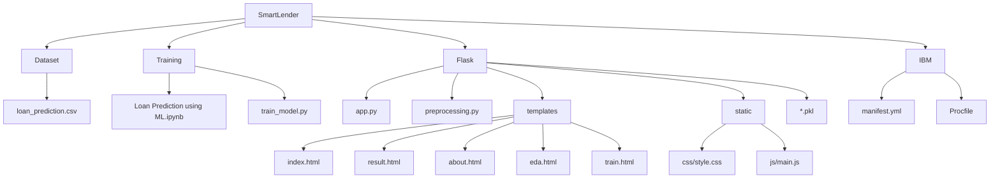
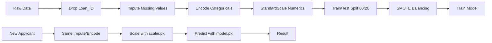

<div align="center">

# 💳 Smart Lender

### AI-Powered Applicant Creditworthiness Prediction

[](https://python.org)
[](https://flask.palletsprojects.com)
[](https://xgboost.readthedocs.io)
[](https://scikit-learn.org)
[](https://getbootstrap.com)
[](LICENSE)

<br />


---

<br />

</div>

## 🌟 Overview

**Smart Lender** is an end-to-end **machine learning web application** that predicts whether a loan applicant should be **Approved** or **Rejected**, helping financial institutions make faster, more consistent, and data-driven lending decisions.

The prediction engine analyzes **11 applicant features** — from income and credit history to employment status and property area — through an ensemble of **4 ML models**, with **XGBoost** delivering the best performance.

<br />

## ✨ Key Features

<table>
<tr>
<td width="50%" valign="top">

### 🎯 Real-time Predictions
Get instant loan approval decisions with **approval probability** and **confidence score** for every prediction.

- XGBoost-powered inference engine
- Sub-second prediction latency
- Rule-based recommendations in plain language

</td>
<td width="50%" valign="top">

### 🔬 Data-Driven Insights
Built on comprehensive **Exploratory Data Analysis** across 614 applicant records.

- 3 analysis types: Univariate, Bivariate, Multivariate
- Interactive visualizations
- Pattern discovery & feature importance

</td>
</tr>
<tr>
<td width="50%" valign="top">

### 🧠 Multi-Model Ensemble
Compare **4 ML models** side-by-side with full metrics.

| Model | Test F1 |
|-------|---------|
| Decision Tree | 0.780 |
| Random Forest | 0.864 |
| KNN | 0.826 |
| **XGBoost ⭐** | **0.870** |

</td>
<td width="50%" valign="top">

### 🚀 Production Ready
Deploy to **IBM Cloud** with zero-config.

- Gunicorn WSGI server
- Cloud Foundry manifest included
- Environment-ready for production

</td>
</tr>
</table>

<br />

## 📊 Dataset

<details open>
<summary><strong>Loan Prediction Dataset</strong> — 614 records, 13 columns</summary>

<br />

| Column | Type | Description |
|--------|------|-------------|
| `Loan_ID` | ID | Unique identifier (dropped during training) |
| `Gender` | Categorical | Male / Female |
| `Married` | Categorical | Yes / No |
| `Dependents` | Categorical | 0, 1, 2, 3+ |
| `Education` | Categorical | Graduate / Not Graduate |
| `Self_Employed` | Categorical | Yes / No |
| `ApplicantIncome` | Numeric | Applicant's income |
| `CoapplicantIncome` | Numeric | Co-applicant's income |
| `LoanAmount` | Numeric | Loan amount (in thousands) |
| `Loan_Amount_Term` | Numeric | Loan term (months) |
| `Credit_History` | Binary | 1 (good) / 0 (poor) |
| `Property_Area` | Categorical | Urban / Semiurban / Rural |
| `Loan_Status` | **Target** | Y (Approved) / N (Rejected) |

**Target Distribution:** ~69% Approved / ~31% Rejected

</details>

<br />

## 🧰 Technology Stack

<table>
<tr>
<th>Layer</th>
<th>Tools</th>
</tr>
<tr>
<td><strong>Language</strong></td>
<td>

</td>
</tr>
<tr>
<td><strong>Data Science</strong></td>
<td>


</td>
</tr>
<tr>
<td><strong>Machine Learning</strong></td>
<td>


</td>
</tr>
<tr>
<td><strong>Web App</strong></td>
<td>


</td>
</tr>
<tr>
<td><strong>Deployment</strong></td>
<td>


</td>
</tr>
</table>

<br />

## 🏗️ Project Structure



<br />

## 🚀 Quick Start

### 📋 Prerequisites

- Python 3.13+
- pip package manager

### 🛠️ Installation

```bash
# 1. Clone the repository
git clone https://github.com/<your-username>/SmartLender.git
cd SmartLender

# 2. Create virtual environment
python -m venv venv

# 3. Activate it
# Windows (PowerShell):
.\venv\Scripts\Activate.ps1
# Windows (Git Bash):
source venv/Scripts/activate
# Linux / macOS:
source venv/bin/activate

# 4. Install dependencies
pip install --upgrade pip
pip install -r requirements.txt
```

### 🏋️ Train Models

```bash
python Training/train_model.py
```

This generates:
- `Flask/best_model.pkl` — XGBoost (best performer)
- `Flask/rdf.pkl` — Random Forest (fallback)
- `Flask/scale.pkl` — StandardScaler

Alternatively, run the Jupyter notebook:
```bash
jupyter notebook "Training/Loan Prediction using ML.ipynb"
```

### 🌐 Run the Web App

```bash
cd Flask
python app.py
```

Open **[http://127.0.0.1:5000](http://127.0.0.1:5000)** in your browser.

<br />

## 📈 Model Performance

<table align="center">
<tr>
<th>Model</th>
<th>Train Acc</th>
<th>Test Acc</th>
<th>Test F1</th>
<th>ROC-AUC</th>
</tr>
<tr>
<td>🌐 Decision Tree</td>
<td align="center">~82%</td>
<td align="center">~72%</td>
<td align="center">0.780</td>
<td align="center">0.801</td>
</tr>
<tr>
<td>🌲 Random Forest</td>
<td align="center">~92%</td>
<td align="center">~80%</td>
<td align="center">0.864</td>
<td align="center">0.783</td>
</tr>
<tr>
<td>🔍 KNN</td>
<td align="center">~100%</td>
<td align="center">~76%</td>
<td align="center">0.826</td>
<td align="center">0.780</td>
</tr>
<tr>
<td><strong>⚡ XGBoost ⭐</strong></td>
<td align="center"><strong>~86%</strong></td>
<td align="center"><strong>~81%</strong></td>
<td align="center"><strong>0.870</strong></td>
<td align="center">0.772</td>
</tr>
</table>

> **Best model selected by test F1** (robust to class imbalance) — **XGBoost** is saved as `Flask/best_model.pkl`.

<br />

## 🔧 Preprocessing Pipeline

The **shared preprocessing** ensures identical transforms in training & inference:



<br />

## ☁️ Deployment (IBM Cloud)

```bash
# 1. Install IBM Cloud CLI & login
ibmcloud login
ibmcloud target --cf

# 2. Train models locally
python Training/train_model.py

# 3. Push to Cloud Foundry
ibmcloud cf push
```

> Uses `IBM/manifest.yml`, `IBM/runtime.txt`, and `IBM/Procfile` for configuration.

<br />

## 🖥️ Screenshots

<details>
<summary><strong>Click to view screenshots</strong></summary>

<br />

> Place your screenshots in `Flask/static/images/` and link them here.

| Page | Preview |
|------|---------|
| **Prediction Form** | `Flask/static/images/home.png` |
| **Approved Result** | `Flask/static/images/approved.png` |
| **Rejected Result** | `Flask/static/images/rejected.png` |
| **EDA Page** | `Flask/static/images/eda.png` |
| **Training Pipeline** | `Flask/static/images/training.png` |

</details>

<br />

## 🔭 Roadmap

- [x] Real-time prediction with confidence scoring
- [x] Multi-model comparison (DT, RF, KNN, XGBoost)
- [x] SMOTE balancing for imbalanced classes
- [x] Interactive EDA with 9 visualization types
- [x] Live training pipeline with log streaming
- [ ] Database persistence for audit & monitoring
- [ ] SHAP explainability for model decisions
- [ ] Periodic automated retraining (cron)
- [ ] User authentication for loan officers
- [ ] Batch prediction via CSV upload
- [ ] Probability calibration (Platt / isotonic)

<br />


## 👨‍💻 Author

**A. SasidharanReddy**

## 📄 License

Distributed under the **MIT License**. See [`LICENSE`](LICENSE) for details.

<br />

---

<div align="center">

Made  using Python, Flask & Machine Learning

[⬆ Back to top](#-smart-lender)

</div>
